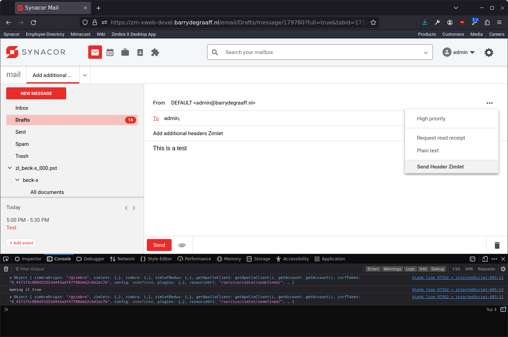

# Setting email headers from Zimlets using the ONSEND event and Redux

This is an example Zimlet that shows how to send emails with additional headers. This Zimlet uses Redux to store a variable that keeps track of whether or not the user has clicked a menu item.

Based on this variable the extra headers will be added to the email by using the ***SendCustomHeaderMessage*** component which is added in Zimbra 10.0.9 and the Zimlet event ONSEND.

For more information about Zimlet events go to: https://github.com/Zimbra/zimlet-cli/wiki/Capture-Zimbra-events-inside-a-Zimlet

For more information on how to load this Zimlet using Sideloader go to: https://github.com/Zimbra/zm-zimlet-guide

Before using the Zimlet make sure to allow the setting of the test headers, run as the `zimbra` user the following commands:

```
zmprov mcf +zimbraCustomMimeHeaderNameAllowed X-Zimbra-App
zmprov mcf +zimbraCustomMimeHeaderNameAllowed X-Zimbra-Type
```

After loading the Zimlet in Sideloader you can find it here:



Inspect the code in the example Zimlet to understand the inner workings of Redux and the ***SendCustomHeaderMessage*** component.
